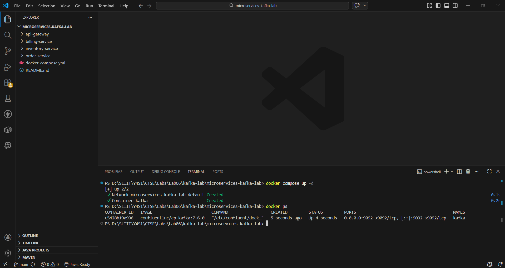
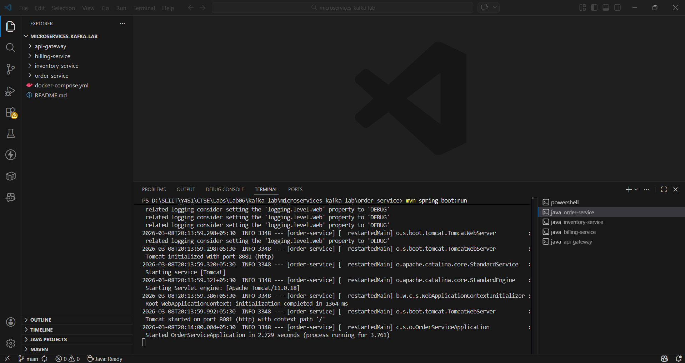
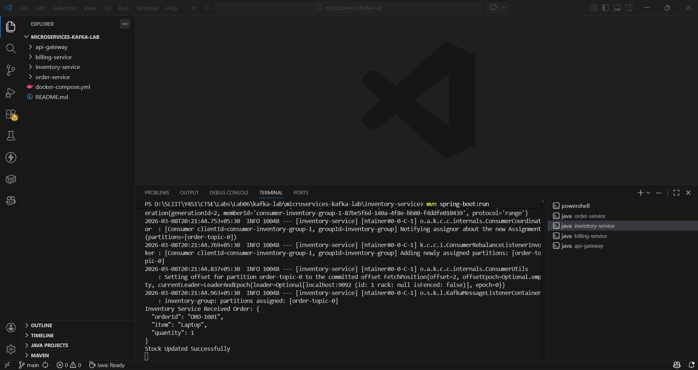
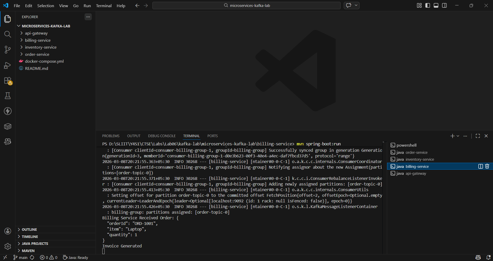
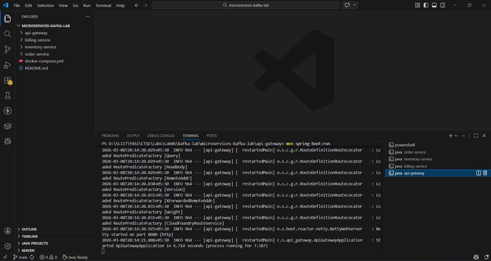
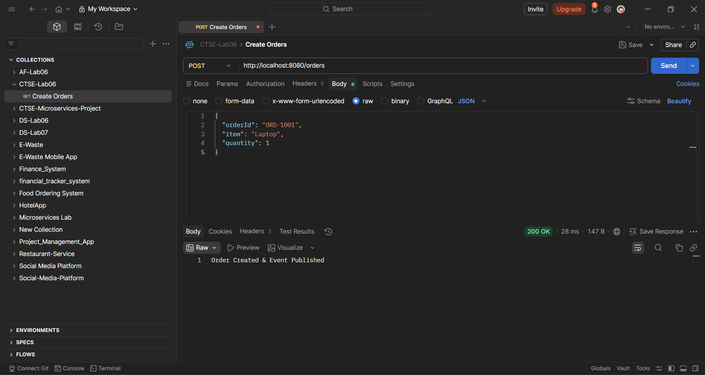

# Kafka Event-Driven Microservices Lab

This project demonstrates a **Microservices Architecture using Apache
Kafka for event-driven communication**.

The system consists of multiple independent microservices that
communicate asynchronously through **Kafka topics**.

------------------------------------------------------------------------

# System Architecture

The system contains the following services:

-   API Gateway
-   Order Service
-   Inventory Service
-   Billing Service
-   Apache Kafka (Message Broker)

------------------------------------------------------------------------

# Architecture Flow

```
Client
↓
API Gateway
↓
Order Service
↓
Kafka Topic
↓
Inventory Service
↓
Billing Service
```

1.  Client sends an order request through **Postman**
2.  **API Gateway** routes the request to **Order Service**
3.  **Order Service publishes an event** to Kafka topic `order-topic`
4.  **Inventory Service consumes the event** and updates stock
5.  **Billing Service consumes the event** and generates invoice

------------------------------------------------------------------------

# Project Structure

```
microservices-kafka-lab
├── api-gateway
├── billing-service
├── inventory-service
├── order-service
├── docker-compose.yml
└── README.md
└── screenshots
```

------------------------------------------------------------------------

# Technologies Used

-   Java
-   Spring Boot
-   Spring Cloud Gateway
-   Apache Kafka
-   Docker
-   Maven
-   Postman

------------------------------------------------------------------------

# Step 1 --- Start Kafka

Run Kafka using Docker.
```
docker compose up -d
```
Verify container:
```
docker ps
```
Screenshot:



------------------------------------------------------------------------

# Step 2 --- Run Order Service
```
cd order-service 
```
```
mvn spring-boot:run
```
Service runs on:
```
http://localhost:8081
```
Screenshot:



------------------------------------------------------------------------

# Step 3 --- Run Inventory Service
```
cd inventory-service 
```
```
mvn spring-boot:run
```
Inventory service listens to the Kafka topic and updates stock.

Screenshot:



------------------------------------------------------------------------

# Step 4 --- Run Billing Service
```
cd billing-service 
```
```
mvn spring-boot:run
```
Billing service consumes Kafka events and generates invoices.

Screenshot:



------------------------------------------------------------------------

# Step 5 --- Run API Gateway
```
cd api-gateway 
```
```
mvn spring-boot:run
```
Gateway runs on:
```
http://localhost:8080
```
Screenshot:



------------------------------------------------------------------------

# Step 6 --- Test Using Postman

POST http://localhost:8080/orders

Request Body:
```
{ 
    "orderId": "ORD-1001", 
    "item": "Laptop", 
    "quantity": 1 
}
```
Response:
```
Order Created & Event Published
```
Screenshot:



------------------------------------------------------------------------

# Event Flow

```
Client
↓
API Gateway
↓
Order Service
↓
Kafka Topic (order-topic)
↓
Inventory Service
↓
Billing Service
```

------------------------------------------------------------------------

# Conclusion

This project demonstrates how **Apache Kafka enables asynchronous communication between microservices using an event-driven architecture**.

Benefits:

-   Loose coupling between services
-   High scalability
-   Improved reliability
-   Better system performance

------------------------------------------------------------------------

